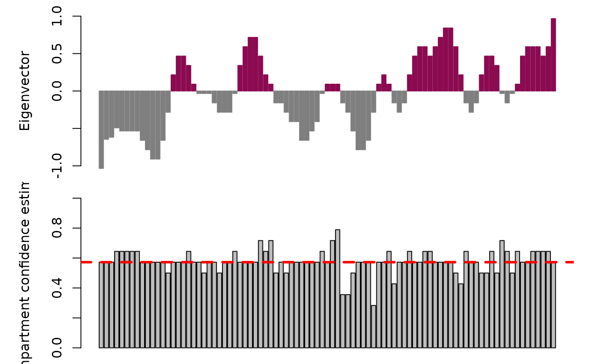
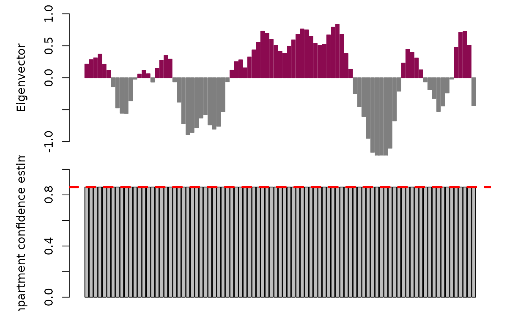
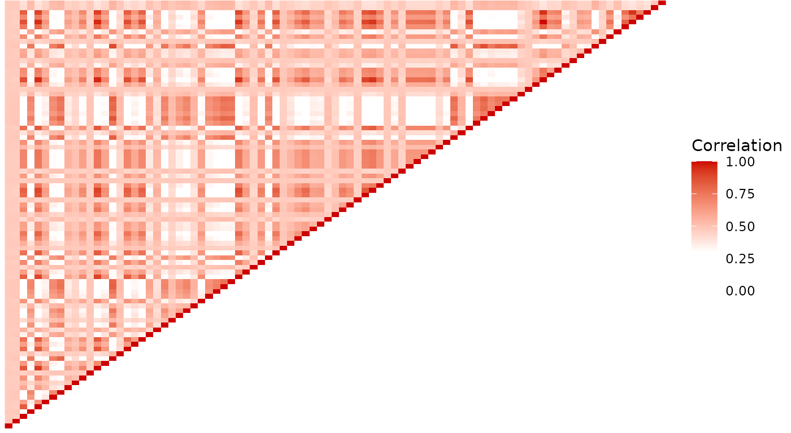

# Direct inference of higher-order chromatin structure in individual cells from scRNA-seq and scATAC-seq with compartmap

## Quick start with example data

#### Input

The expected input for *compartmap* is a `RangedSummarizedExperiment`
object. These can be built using the built-in function
[`importBigWig()`](https://huishenlab.github.io/compartmap/reference/importBigWig.md)
if starting from BigWigs (recommended for scRNA-seq) or from a feature
level object like a `SingleCellExperiment` with the `rowRanges` slot
populated with the GRanges for each feature (see below in the examples).

As an example for the quick start, we will load an existing example
scRNA-seq data from K562. These data are derived from Johnson and Rhodes
et. al 2021 STORM-seq They have already been TF-IDF transformed with
[`transformTFIDF()`](https://huishenlab.github.io/compartmap/reference/transformTFIDF.md).
See further down if starting from bigWigs or a feature based object. See
the full workflow below for more details.

``` r
set.seed(42)
library(compartmap)
data("k562_scrna_chr14", package = "compartmap")
```

#### Inferring higher-order chromatin domains at the group and single-cell level

##### Group level inference

Process chr14 of the example K562 scRNA-seq data and infer higher-order
chromatin at 1Mb resolution:

``` r
k562_compartments <- scCompartments(
  k562_scrna_chr14,
  chr = "chr14",
  res = 1e6,
  group = TRUE,
  bootstrap = FALSE,
  genome = "hg19",
  assay = "rna",
  BPPARAM = BiocParallel::MulticoreParam(2)
)
```

##### Single-cell level inference

To infer higher-order domains in single cells and quantifying sign
coherence with the bootstrapping procedure, you can run:

``` r
# Sub-sample to 10 cells as an example
k562_scrna_chr14.sub <- k562_scrna_chr14[,
    sample(colnames(k562_scrna_chr14), size = 10, replace = FALSE)
]

k562_compartments.boot <- scCompartments(
  k562_scrna_chr14.sub,
  chr = "chr14",
  res = 1e6,
  group = FALSE,
  bootstrap = TRUE,
  num.bootstraps = 10,
  genome = "hg19",
  assay = "rna",
  BPPARAM = BiocParallel::MulticoreParam(2)
)

# Flip the domain sign if the sign coherence is discordant in 80% of the bootstraps
k562_compartments.boot.fix <- fixCompartments(
  k562_compartments.boot,
  min.conf = 0.8
)

# Look at the first cell in the GRangesList object
k562_compartments.grlist <- condenseSE(k562_compartments.boot.fix)
k562_compartments.grlist[[1]]
## GRanges object with 89 ranges and 13 metadata columns:
##                             seqnames              ranges strand |        pc
##                                <Rle>           <IRanges>  <Rle> | <numeric>
##     chr14:19000000-19999999    chr14   19000000-19999999      * | -1.034296
##     chr14:20000000-20999999    chr14   20000000-20999999      * | -0.645186
##     chr14:21000000-21999999    chr14   21000000-21999999      * | -0.617392
##     chr14:22000000-22999999    chr14   22000000-22999999      * | -0.492321
##     chr14:23000000-23999999    chr14   23000000-23999999      * | -0.534011
##                         ...      ...                 ...    ... .       ...
##   chr14:103000000-103999999    chr14 103000000-103999999      * |  0.591628
##   chr14:104000000-104999999    chr14 104000000-104999999      * |  0.591628
##   chr14:105000000-105999999    chr14 105000000-105999999      * |  0.466557
##   chr14:106000000-106999999    chr14 106000000-106999999      * |  0.591628
##   chr14:107000000-107349539    chr14 107000000-107349539      * |  0.966842
##                             compartments     score boot.open boot.closed
##                              <character> <numeric> <numeric>   <numeric>
##     chr14:19000000-19999999       closed -1.034296         4           6
##     chr14:20000000-20999999       closed -0.645186         4           6
##     chr14:21000000-21999999       closed -0.617392         4           6
##     chr14:22000000-22999999       closed -0.492321         3           7
##     chr14:23000000-23999999       closed -0.534011         3           7
##                         ...          ...       ...       ...         ...
##   chr14:103000000-103999999         open  0.591628         7           3
##   chr14:104000000-104999999         open  0.591628         7           3
##   chr14:105000000-105999999         open  0.466557         7           3
##   chr14:106000000-106999999         open  0.591628         7           3
##   chr14:107000000-107349539         open  0.966842         6           4
##                              conf.est conf.est.lowerCI conf.est.upperCI
##                             <numeric>        <numeric>        <numeric>
##     chr14:19000000-19999999  0.572247         0.311604         0.832889
##     chr14:20000000-20999999  0.572247         0.311604         0.832889
##     chr14:21000000-21999999  0.572247         0.311604         0.832889
##     chr14:22000000-22999999  0.644493         0.392325         0.896662
##     chr14:23000000-23999999  0.644493         0.392325         0.896662
##                         ...       ...              ...              ...
##   chr14:103000000-103999999  0.644493         0.392325         0.896662
##   chr14:104000000-104999999  0.644493         0.392325         0.896662
##   chr14:105000000-105999999  0.644493         0.392325         0.896662
##   chr14:106000000-106999999  0.644493         0.392325         0.896662
##   chr14:107000000-107349539  0.572247         0.311604         0.832889
##                             flip.compartment flip.score flip.conf.est
##                                    <logical>  <numeric>     <numeric>
##     chr14:19000000-19999999            FALSE  -1.034296      0.572247
##     chr14:20000000-20999999            FALSE  -0.645186      0.572247
##     chr14:21000000-21999999            FALSE  -0.617392      0.572247
##     chr14:22000000-22999999            FALSE  -0.492321      0.644493
##     chr14:23000000-23999999            FALSE  -0.534011      0.644493
##                         ...              ...        ...           ...
##   chr14:103000000-103999999            FALSE   0.591628      0.644493
##   chr14:104000000-104999999            FALSE   0.591628      0.644493
##   chr14:105000000-105999999            FALSE   0.466557      0.644493
##   chr14:106000000-106999999            FALSE   0.591628      0.644493
##   chr14:107000000-107349539            FALSE   0.966842      0.572247
##                             flip.conf.est.upperCI flip.conf.est.lowerCI
##                                         <numeric>             <numeric>
##     chr14:19000000-19999999              0.832889              0.311604
##     chr14:20000000-20999999              0.832889              0.311604
##     chr14:21000000-21999999              0.832889              0.311604
##     chr14:22000000-22999999              0.896662              0.392325
##     chr14:23000000-23999999              0.896662              0.392325
##                         ...                   ...                   ...
##   chr14:103000000-103999999              0.896662              0.392325
##   chr14:104000000-104999999              0.896662              0.392325
##   chr14:105000000-105999999              0.896662              0.392325
##   chr14:106000000-106999999              0.896662              0.392325
##   chr14:107000000-107349539              0.832889              0.311604
##   -------
##   seqinfo: 1 sequence from an unspecified genome; no seqlengths
```

#### Visualization of inferred chromatin domains

Once the data have been processed at either the group or single-cell
level, one can visualize the results using the `plotAB` function in
*compartmap*. Notably, we can include the confidence intervals and
median, chromosome-wide confidence estimate derived from the bootstrap
procedure for sign coherence. At 50%, this suggests that estimates are
evenly split between open and closed states. This may be due to data
sparsity or heterogeneity in the data. One possible approach to resolve
this is to increase the number of bootstraps performed if initially set
low (e.g. 10). Alternatively, it may be a region that is worth
investigating for your data set.

Plot the “fixed” results in cell 1 from above with plotAB with the
confidence intervals and median confidence estimate:

``` r
plotAB(
  k562_compartments.grlist[[1]],
  chr = "chr14",
  with.ci = TRUE,
  median.conf = TRUE
)
```



It is known that sometimes, the domains may be inverted relative to
orthogonal data This is also true in Hi-C and scHi-C domain inference
One can invert all domains by setting `reverse = TRUE` in the
[`plotAB()`](https://huishenlab.github.io/compartmap/reference/plotAB.md)
call

``` r
plotAB(
  k562_compartments.boot.fix[[1]],
  chr = "chr14",
  with.ci = TRUE,
  median.conf = TRUE,
  reverse = TRUE
)
```

#### Extraction of domain inflections

It is often of interest to extract the chromatin domain inflection
points as they transition from “open” to “closed” states to look for
nearby CTCF sites, etc. We can accomplish this task using the
`getDomainInflections` function in *compartmap.*

Domain inflections can be used to look for nearby CTCF sites, etc. Here
we extract single-cell domain inflections:

``` r
k562_cell_1_inflections <- getDomainInflections(
  k562_compartments.grlist[[1]],
  what = "flip.score",
  res = 1e6,
  chrs = "chr14",
  genome = "hg19"
)

# Show the inflection points
k562_cell_1_inflections
## GRanges object with 14 ranges and 0 metadata columns:
##        seqnames    ranges strand
##           <Rle> <IRanges>  <Rle>
##    [1]    chr14  33000000      *
##    [2]    chr14  37999999      *
##    [3]    chr14  46000000      *
##    [4]    chr14  52999999      *
##    [5]    chr14  63000000      *
##    ...      ...       ...    ...
##   [10]    chr14  89999999      *
##   [11]    chr14  93000000      *
##   [12]    chr14  96999999      *
##   [13]    chr14 100000000      *
##   [14]    chr14 107349539      *
##   -------
##   seqinfo: 1 sequence from an unspecified genome; no seqlengths
```

### Importing bigWigs as input to compartmap

The currently recommended input files to *compartmap* for scRNA-seq are
single-cell bigWigs, though does work with a feature/counts based object
as demonstrated in the next section. Single-cell bigWigs can be
generated through several tools, such as
[deeptools](https://deeptools.readthedocs.io/en/latest/). To import
bigWigs, we can use the
[`importBigWig()`](https://huishenlab.github.io/compartmap/reference/importBigWig.md)
function in *compartmap*. This will read in a bigWig file and optionally
summarize to an arbitrary bin size. The bin size used in the
*compartmap* manuscript was 1kb and is what we do here as well.

We can import a list of bigWig files and merge them into a
`RangedSummarizedExperiment` object:

``` r
# list the example bigWigs
bigwigs <- list.files(
    system.file("extdata", package = "compartmap"), full.names = TRUE
)

# generate the 1kb bins
data("hg19.gr", package = "compartmap")
kb_bins <- tileGenome(
  seqlengths = seqlengths(hg19.gr)["chr14"],
  tilewidth = 1000,
  cut.last.tile.in.chrom = TRUE
)

# import
bigwigs_lst <- lapply(bigwigs, function(x) {
  importBigWig(x,
    bins = kb_bins,
    summarize = TRUE, genome = "hg19"
  )
})

# combine
bigwig_rse <- do.call(cbind, bigwigs_lst)
colnames(bigwig_rse) <- c("cell_1", "cell_2")
```

### Starting with a feature or counts-based object

In the cases where we do not have or can’t start with bigWigs
(e.g. scATAC), we can start with a feature-level or counts object
(e.g. `SingleCellExperiment`). The two things that must be there are
making sure `rowRanges` and `colnames` are set for each feature and
cell/sample. We will use the scATAC-seq from K562 as an example of how
the object should look, but will also show one way to add `rowRanges` to
a `SingleCellExperiment`, which works the same way for a
`SummarizedExperiment` object.

Loading the scATAC-seq example data pre-processed using the `csaw`
package:

``` r
data("k562_scatac_chr14", package = "compartmap")

# show the overall object structure
# NOTE that the colnames are also there and the assay name is 'counts'
k562_scatac_chr14
## class: RangedSummarizedExperiment 
## dim: 11404 279 
## metadata(6): spacing width ... param final.ext
## assays(1): counts
## rownames: NULL
## rowData names(0):
## colnames(279): cell_1 cell_2 ... cell_287 cell_288
## colData names(4): bam.files totals ext rlen
```

Showing the `rowRanges` slot is a `GRanges` for each feature

``` r
rowRanges(k562_scatac_chr14)
## GRanges object with 11404 ranges and 0 metadata columns:
##           seqnames              ranges strand
##              <Rle>           <IRanges>  <Rle>
##       [1]    chr14   19614351-19614500      *
##       [2]    chr14   19614401-19614550      *
##       [3]    chr14   19614451-19614600      *
##       [4]    chr14   19614501-19614650      *
##       [5]    chr14   19614551-19614700      *
##       ...      ...                 ...    ...
##   [11400]    chr14 106938701-106938850      *
##   [11401]    chr14 106938751-106938900      *
##   [11402]    chr14 106938801-106938950      *
##   [11403]    chr14 107280901-107281050      *
##   [11404]    chr14 107280951-107281100      *
##   -------
##   seqinfo: 1 sequence from an unspecified genome
```

But if we don’t have `rowRanges` for something like a
`SingleCellExperiment` we are working with, we need to generate them.
Thus, we will show an example of how to add `rowRanges` from a GTF file
to a `SingleCellExperiment`.

First we define a helper function for adding `rowRanges` (modified from
<https://github.com/trichelab/velocessor/blob/master/R/import_plate_txis.R>).
**NOTE**: you can modify the `rtracklayer::import` to not subset to gene
level if using feature level information (e.g. a bed file of fragments
for scATAC)

``` r
getRowRanges <- function(gtf, asys) {
  gxs <- subset(rtracklayer::import(gtf), type == "gene")
  names(gxs) <- gxs$gene_id
  granges(gxs)[rownames(asys)]
}
```

Import the example HEK293T SingleCellExperiment from the SMART-seq3
paper:

``` r
data("ss3_umi_sce", package = "compartmap")

# import the example GTF with the helper function
gtf_rowranges <- getRowRanges(
  system.file("extdata/grch38_91_hsapiens.gtf.gz",
    package = "compartmap"
  ),
  ss3_umi_sce
)

# add rowRanges to the SingleCellExperiment
rowRanges(ss3_umi_sce) <- gtf_rowranges
```

We can now proceed to the next steps and run the *compartmap* workflow.

### Running the compartmap workflow

Once we have data in a `RangedSummarizedExperiment` or other type of
`SummarizedExperiment` with the `rowRanges` slot filled, we can proceed
through the *compartmap* workflow. We will use the same K562 scRNA-seq
data shown in the manuscript on chromosome 14 here as the example.

``` r
# Load example K562 data imported using importBigWig
data("k562_scrna_raw", package = "compartmap")

# TF-IDF transform the signals
k562_scrna_chr14_tfidf <- transformTFIDF(assay(k562_scrna_se_chr14))

# Add back the TF-IDF counts to the object in the counts slot
assay(k562_scrna_se_chr14, "counts") <- k562_scrna_chr14_tfidf

# Compute chromatin domains at the group level
k562_scrna_chr14_raw_domains <- scCompartments(k562_scrna_se_chr14,
  chr = "chr14",
  res = 1e6,
  group = TRUE,
  bootstrap = TRUE,
  num.bootstraps = 10,
  genome = "hg19",
  assay = "rna",
  BPPARAM = BiocParallel::MulticoreParam(2)
)
```

For single-cells, run:

``` r
k562_scrna_chr14_raw_domains <- scCompartments(
  k562_scrna_se_chr14,
  chr = "chr14",
  res = 1e6,
  group = FALSE,
  bootstrap = TRUE,
  num.bootstraps = 10,
  genome = "hg19",
  assay = "rna"
)
```

‘Fix’ compartments with discordant sign coherence:

``` r
k562_scrna_chr14_raw_domains.fix <- fixCompartments(k562_scrna_chr14_raw_domains)

# Plot results
plotAB(k562_scrna_chr14_raw_domains.fix,
  chr = "chr14",
  with.ci = TRUE,
  median.conf = TRUE
)
```



### Higher-order chromatin interaction maps

Another interesting aspect we can derive from scRNA and scATAC is the
higher-order interacting domains through denoising of the correlation
matrices using a Random Matrix Theory approach. This is often
represented with the “plaid-like” patterning shown in Hi-C and scHi-C
approaches where stronger correlations (e.g. greater intensity of red)
indicates interacting domains relative to lesser correlation. We can do
something similar here through iterative denoising using Random Matrix
Theory approach:

``` r
k562_scrna_chr14_rmt <- getDenoisedCorMatrix(
  k562_scrna_chr14,
  res = 1e6,
  chr = "chr14",
  genome = "hg19",
  assay = "rna",
  iter = 2
)
## Shrinking bins with the JSE.
## Denoising the correlation matrix using RMT.
## Iterative denoising. Iteration: 2

# Plot the interaction map
plotCorMatrix(k562_scrna_chr14_rmt, uppertri = TRUE)
```


